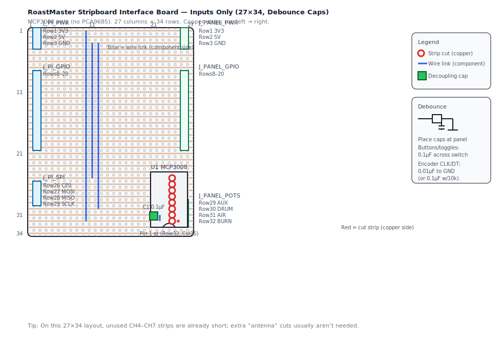

# RoastMaster Stripboard Interface Board — Inputs Only (27×34)

This is an **ultra-compact** version of `docs/stripboard-interface-board-inputs-only.md` designed to fit a
**27 columns × 34 rows** stripboard.

**What’s different in this 27×34 variant:**
- Board is **27 columns × 34 rows**
- Right-side panel headers (`J_PANEL_*`) move to **Col 26** (leaves **Col 27** as margin/spare)
- MCP3008 socket shifts left to fit the narrower board

Pi-side pinouts + GPIO inputs are unchanged. Use the tables in:
- `docs/stripboard-interface-board-inputs-only.md`

This 27×34 variant adds a **4th pot wiper** on MCP3008 **CH3** — see [Pot wiper mapping](#pot-wiper-mapping-this-2734-board).

## Stripboard size + coordinate system

- Diagram board size: **27 columns × 34 rows**
- Coordinates are **(Row, Col)** with **Row 1 at the top**, **Col 1 at the left**
- Copper strips run **left → right** (horizontal)

## Layout diagram (component side)

Layout-only (no debounce callout): `docs/assets/stripboard-interface-board-inputs-only-27x34.svg`

Open directly: `docs/assets/stripboard-interface-board-inputs-only-27x34-debounce.svg`

## Debounce capacitors (recommended)

Same guidance as the standard inputs-only variant:
- Place debounce capacitors at the **panel end** across switch terminals (signal ↔ GND).

Full notes: `docs/stripboard-interface-board-inputs-only.md`

## Strip cuts (copper side)

### MCP3008 isolation cuts

Cut **8 strips** at:
- (Row 25–32, Col 24)

This separates the MCP3008 **SPI/power side** (left) from the **analog channel side** (right).

## Placement summary (by coordinate)

| Ref | Type | Location |
|---|---|---|
| `J_PI_PWR` | 1×3 header | Col 2, Rows 1–3 |
| `J_PANEL_PWR` | 1×3 header | Col 26, Rows 1–3 |
| `J_PI_GPIO` | 1×13 header | Col 2, Rows 8–20 |
| `J_PANEL_GPIO` | 1×13 header | Col 26, Rows 8–20 |
| `U1` | DIP-16 socket | Col 22 & Col 25, Rows 25–32 |
| `J_PI_SPI` | 1×4 header | Col 2, Rows 26–29 |
| `J_PANEL_POTS` | 1×4 header | Col 26, Rows 29–32 |

## MCP3008 socket placement

- `U1` (MCP3008 DIP-16 socket)
  - Left pins in **Col 22**, right pins in **Col 25**
  - Top of chip starts at **Row 25**
  - Orient it so **pin 1 is at (Row 32, Col 25)** (bottom-right; notch at the bottom)

## MCP3008 power wiring + decoupling

- Link `VREF` to `VDD`:
  - Wire link between (Row 31, Col 22) and (Row 32, Col 22)
- Decoupling capacitor `C1` 0.1µF:
  - Between (Row 32, Col 21) and (Row 30, Col 21)
- Feed 3.3V and GND down from the top rails (same as the standard layout):
  - Wire link between (Row 1, Col 10) and (Row 32, Col 10)  ← MCP3008 VDD (3V3)
  - Wire link between (Row 3, Col 11) and (Row 25, Col 11)  ← MCP3008 DGND
  - Wire link between (Row 3, Col 12) and (Row 30, Col 12)  ← MCP3008 AGND

## Pot wiper mapping (this 27×34 board)

This variant breaks out **4** MCP3008 channels to the panel.

| Board Row | MCP3008 channel | Suggested label |
|---:|---:|---|
| 29 | CH3 | AUX (Pot 4) |
| 30 | CH2 | DRUM |
| 31 | CH1 | AIR |
| 32 | CH0 | BURNER |
