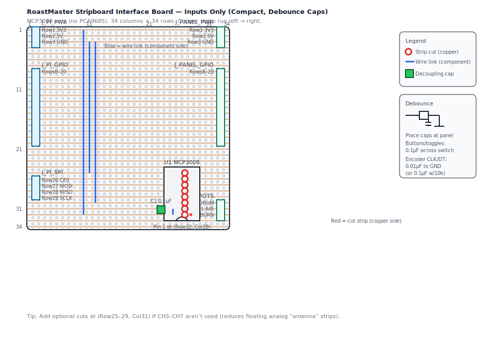

# RoastMaster Stripboard Interface Board — Inputs Only (Compact)

This is a **smaller-footprint** version of `docs/stripboard-interface-board-inputs-only.md`.

**What’s different in this compact variant:**
- Board is **34 columns × 34 rows**
- Right-side panel headers (`J_PANEL_*`) move to **Col 33** (leaves **Col 34** as margin/spare)

Everything else (signals, GPIO mapping, MCP3008 wiring) is the same as the non-compact inputs-only build.

Need an even smaller board? See `docs/stripboard-interface-board-inputs-only-27x34.md`.

## Stripboard size + coordinate system

- Diagram board size: **34 columns × 34 rows**
- Coordinates are **(Row, Col)** with **Row 1 at the top**, **Col 1 at the left**
- Copper strips run **left → right** (horizontal)

## Layout diagram (component side)

Layout-only (no debounce callout): `docs/assets/stripboard-interface-board-inputs-only-compact.svg`

Open directly: `docs/assets/stripboard-interface-board-inputs-only-compact-debounce.svg`

## Debounce capacitors (recommended)

Same guidance as the standard inputs-only variant:
- Place debounce capacitors at the **panel end** across switch terminals (signal ↔ GND).

Full notes: `docs/stripboard-interface-board-inputs-only.md`

## Step-by-step build (differences)

1. **Cut stripboard to size**
   - Target: **34 cols × 34 rows** (or larger; keep the same row/col references).

2. **Make strip cuts (copper side)**
   - Same MCP3008 isolation cuts as the standard variant (see below).
   - Optional unused-channel cuts move slightly (see below).

3. **Solder headers + MCP3008 socket**
   - Same as `docs/stripboard-interface-board-inputs-only.md`, but use the updated column positions in
     [Placement summary](#placement-summary-by-coordinate).

## Connector pinouts

All pinouts/tables are unchanged. Use:
- `docs/stripboard-interface-board-inputs-only.md`

## Strip cuts (copper side)

### MCP3008 isolation cuts

Cut **8 strips** at:
- (Row 25–32, Col 27)

### Optional: shorten unused analog channel strips

If you won’t use CH3–CH7 soon, cut:
- (Row 25–29, Col 31)

## Placement summary (by coordinate)

| Ref | Type | Location |
|---|---|---|
| `J_PI_PWR` | 1×3 header | Col 2, Rows 1–3 |
| `J_PANEL_PWR` | 1×3 header | Col 33, Rows 1–3 |
| `J_PI_GPIO` | 1×13 header | Col 2, Rows 8–20 |
| `J_PANEL_GPIO` | 1×13 header | Col 33, Rows 8–20 |
| `U1` | DIP-16 socket | Col 25 & Col 28, Rows 25–32 |
| `J_PI_SPI` | 1×4 header | Col 2, Rows 26–29 |
| `J_PANEL_POTS` | 1×3 header | Col 33, Rows 30–32 |

## Bring-up checklist

Same bring-up steps as the standard inputs-only build:
- `docs/stripboard-interface-board-inputs-only.md`
