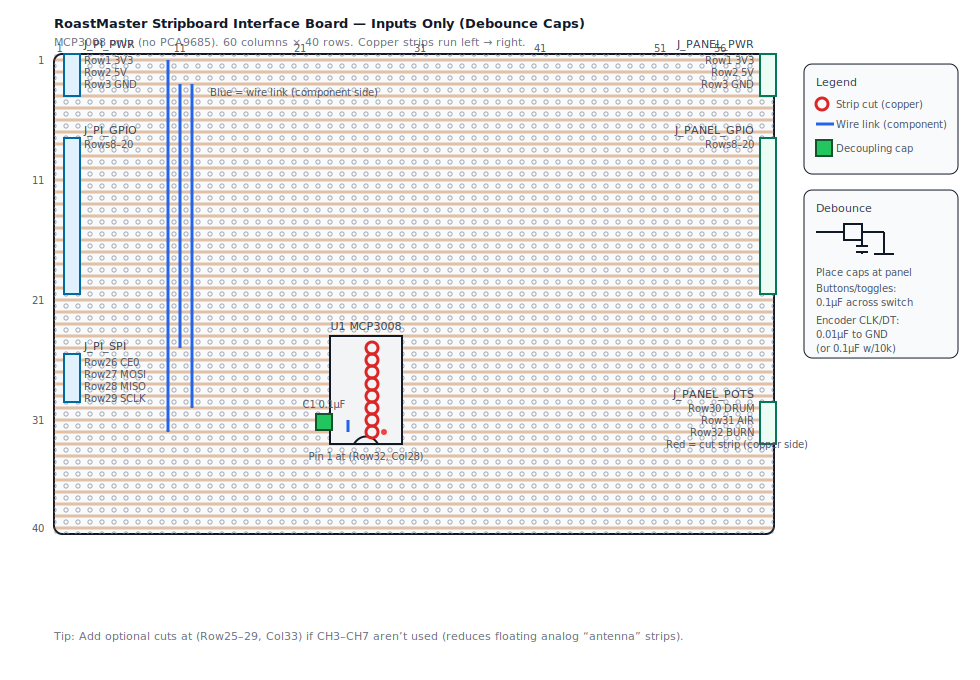

# RoastMaster Stripboard Interface Board — Inputs Only (MCP3008 + GPIO)

This is a simplified variant of `docs/stripboard-interface-board.md`.

**What’s different in this variant:**
- **No PCA9685** (no VU meters, no panel LEDs)
- **No FCE / SCE** buttons
- Adds a **RESET** momentary button instead

It supports:
- 4× maintained toggle switches (POWER / HEAT / COOL / MODE)
- 5× roast-event buttons (CHARGE / FCS / SCS / DROP / SAVE)
- 1× RESET button
- 1× rotary encoder (CLK/DT + push switch)
- 3× pots via **MCP3008** SPI ADC

## Stripboard size + coordinate system

- Diagram board size: **60 columns × 40 rows**
- Coordinates are **(Row, Col)** with **Row 1 at the top**, **Col 1 at the left**
- Copper strips run **left → right** (horizontal)

## Layout diagram (component side)

Layout-only (no debounce callout): `docs/assets/stripboard-interface-board-inputs-only.svg`

Open directly: `docs/assets/stripboard-interface-board-inputs-only-debounce.svg`

Need a smaller board? See the compact variants:
- `docs/stripboard-interface-board-inputs-only-compact.md` (34×34)
- `docs/stripboard-interface-board-inputs-only-27x34.md` (27×34)

## Debounce capacitors (recommended)

Software debounce is usually enough, but with a real panel (longer wires + noise) it’s worth adding caps.

**Recommended placement:** at the **panel end**, directly across the switch terminals (signal ↔ GND).

- **Toggles + momentary buttons + encoder push (`ENC_SW`)**: **0.1µF** ceramic (signal → panel GND)
- **Encoder `ENC_CLK` / `ENC_DT`**:
  - With Pi **internal pull-ups**: start with **0.01µF (10nF)** to panel GND
  - With external **10k pull-ups**: **0.1µF** is OK

## Step-by-step build

1. **Cut stripboard to size**
   - Target: **60 cols × 40 rows** (or larger; keep the same row/col references).
   - Mark your **Row 1 / Col 1** corner with a permanent marker.

2. **Make strip cuts (copper side)**
   - “Cut at (Row X, Col Y)” means: drill/cut the copper ring at that hole so the strip is broken there.
   - Make the cuts listed in [Strip cuts](#strip-cuts-copper-side) before soldering components.

3. **Solder the headers**
   - Pi side: `J_PI_PWR`, `J_PI_GPIO`, `J_PI_SPI`
   - Panel side: `J_PANEL_PWR`, `J_PANEL_GPIO`, `J_PANEL_POTS`

4. **Solder the MCP3008 socket**
   - Install `U1` (DIP-16 socket) per [MCP3008 socket placement](#mcp3008-socket-placement).
   - Don’t insert the MCP3008 IC yet.

5. **Add links + capacitor**
   - `VREF↔VDD` link
   - 3V3 + GND feed links down to the MCP3008 area
   - `C1` 0.1µF decoupling capacitor near the MCP3008

6. **Continuity + power checks**
   - Confirm no short between **3V3** and **GND**.
   - Confirm the MCP3008 isolation cuts (rows 25–32 at col 27) are open.
   - Power the Pi and confirm you have:
     - **3.3V** on `J_PI_PWR` row 1
     - **GND** on `J_PI_PWR` row 3
   - Insert the MCP3008 into its socket only after these checks pass.

## Connector pinouts

### Pi-side headers (to your T‑Cobbler)

#### `J_PI_PWR` (1×3)

| Board Row | Signal | Connect to Pi physical pin |
|---:|---|---:|
| 1 | 3V3 | 1 (or 17) |
| 2 | 5V (optional) | 2 or 4 |
| 3 | GND | 6 (or any GND) |

#### `J_PI_GPIO` (1×13)

Active‑LOW inputs (wire switches/buttons to GND; enable pull-ups in software).

| Board Row | Panel signal | Pi physical pin | GPIO |
|---:|---|---:|---:|
| 8 | POWER toggle | 16 | GPIO23 |
| 9 | HEAT toggle | 29 | GPIO5 |
| 10 | COOL toggle | 31 | GPIO6 |
| 11 | MODE toggle | 33 | GPIO13 |
| 12 | CHARGE | 36 | GPIO16 |
| 13 | FCS | 37 | GPIO26 |
| 14 | SCS | 40 | GPIO21 |
| 15 | DROP | 32 | GPIO12 |
| 16 | SAVE | 22 | GPIO25 |
| 17 | RESET | 38 | GPIO20 |
| 18 | ENC_CLK | 11 | GPIO17 |
| 19 | ENC_DT | 13 | GPIO27 |
| 20 | ENC_SW | 15 | GPIO22 |

#### `J_PI_SPI` (1×4) — MCP3008 SPI

| Board Row | Signal | Pi physical pin | GPIO |
|---:|---|---:|---:|
| 26 | CE0 | 24 | GPIO8 |
| 27 | MOSI | 19 | GPIO10 |
| 28 | MISO | 21 | GPIO9 |
| 29 | SCLK | 23 | GPIO11 |

### Panel-side headers (to your enclosure wiring)

#### `J_PANEL_PWR` (1×3)

| Board Row | Signal | Typical uses |
|---:|---|---|
| 1 | 3V3 | pot “high” ends |
| 2 | 5V (optional) | (leave unused unless you have a panel 5V load) |
| 3 | GND | all switch/button/encoder commons, pot “low” ends |

#### `J_PANEL_GPIO` (1×13)

Rows match `J_PI_GPIO` rows 8–20.

Wire one side of each switch/button/encoder contact to its `J_PANEL_GPIO` signal, and the other side to `J_PANEL_PWR` **GND**.

#### `J_PANEL_POTS` (1×3)

| Board Row | Pot | Connect to |
|---:|---|---|
| 30 | DRUM wiper | MCP3008 CH2 |
| 31 | AIR wiper | MCP3008 CH1 |
| 32 | BURNER wiper | MCP3008 CH0 |

Pot outer pins:
- one outer lug → `J_PANEL_PWR` **3V3**
- the other outer lug → `J_PANEL_PWR` **GND**

## Strip cuts (copper side)

### MCP3008 isolation cuts

Cut **8 strips** at:
- (Row 25–32, Col 27)

This separates the MCP3008 **SPI/power side** (left) from the **analog channel side** (right).

### Optional: shorten unused analog channel strips (recommended)

If you won’t use CH3–CH7 soon, cut:
- (Row 25–29, Col 33)

## Links + components (component side)

### Placement summary (by coordinate)

| Ref | Type | Location |
|---|---|---|
| `J_PI_PWR` | 1×3 header | Col 2, Rows 1–3 |
| `J_PANEL_PWR` | 1×3 header | Col 60, Rows 1–3 |
| `J_PI_GPIO` | 1×13 header | Col 2, Rows 8–20 |
| `J_PANEL_GPIO` | 1×13 header | Col 60, Rows 8–20 |
| `U1` | DIP-16 socket | Col 25 & Col 28, Rows 25–32 |
| `J_PI_SPI` | 1×4 header | Col 2, Rows 26–29 |
| `J_PANEL_POTS` | 1×3 header | Col 60, Rows 30–32 |

### MCP3008 socket placement

- `U1` (MCP3008 DIP-16 socket)
  - Left pins in **Col 25**, right pins in **Col 28**
  - Top of chip starts at **Row 25**
  - Orient it so **pin 1 is at (Row 32, Col 28)** (bottom-right; notch at the bottom)

### MCP3008 power wiring + decoupling

- Link `VREF` to `VDD`:
  - Wire link between (Row 31, Col 25) and (Row 32, Col 25)
- Decoupling capacitor `C1` 0.1µF:
  - Between (Row 32, Col 24) and (Row 30, Col 24)
- Feed 3.3V and GND down from the top rails:
  - Wire link between (Row 1, Col 10) and (Row 32, Col 10)  ← MCP3008 VDD (3V3)
  - Wire link between (Row 3, Col 11) and (Row 25, Col 11)  ← MCP3008 DGND
  - Wire link between (Row 3, Col 12) and (Row 30, Col 12)  ← MCP3008 AGND

## Bring-up checklist

1. Enable **SPI** on the Pi (`raspi-config` → Interface Options → SPI), reboot.
2. Sanity-check pot readings (CH0–CH2) are stable and map end-to-end.
3. Verify each switch/button/encoder input triggers in software (active‑LOW).
