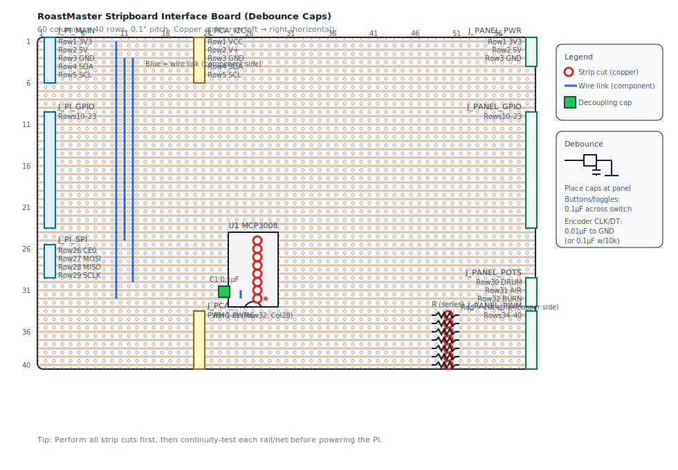

# RoastMaster Stripboard Interface Board (MCP3008 + PCA9685)

This document turns the plan in `docs/hardware-build.md` into a buildable **stripboard**
layout you can solder up, with a matching diagram.

It’s designed to be a “panel interface board” that:

- Brings **panel inputs** (toggles, buttons, encoder) to the Pi’s GPIO
- Reads **3 panel pots** via an **MCP3008** SPI ADC
- Drives **3 VU meters + 4 LEDs** via a **PCA9685** PWM driver (I2C)

## What you’ll build

- **One stripboard** with:
  - MCP3008 (DIP-16) + decoupling
  - Headers for:
    - Pi connections (via your T‑Cobbler)
    - Panel wiring (signals + power)
    - PCA9685 breakout connections (I2C + PWM lines)
  - Series resistors on PWM outputs (meters + LEDs)

## Why this uses smaller headers (not a single 40‑pin bus)

You *can* do a single 40‑pin header, but on **stripboard** it’s usually more work than it looks.

- The **Pi T‑Cobbler is already your 40‑pin breakout**. This interface board only needs ~20 of those pins.
- A 2×20 header on stripboard is fiddly because the two columns of pins are **adjacent**; on horizontal-strip board
  you end up doing lots of cuts/jumpers just to stop pairs of pins shorting together.
- Splitting into a few “functional” headers (power/I2C, SPI, GPIO inputs) lets the stripboard do what it’s good at:
  **one strip row = one signal**, with a Pi-side pin on the left and a panel-side pin on the right.

If you want, I can generate an alternate layout that accepts a **single 40‑pin header** (either ribbon direct-to-board
or mounting the T‑Cobbler as a daughterboard) — it will just have a much larger cut list.

## Assumptions / variants

- Stripboard has **continuous copper strips running left → right** (horizontally).
- You have:
  - **MCP3008** in **DIP-16** form (or a DIP adapter)
  - A **PCA9685 breakout** (Adafruit #815 style or similar)
  - An **Adafruit T‑Cobbler** (used as the Pi GPIO breakout)
- This layout uses **0.1" (2.54mm) headers** for wiring harnesses.
  - If you prefer screw terminals, you can swap any `J_PANEL_*` header for terminals later,
    but the diagram/pinouts assume headers.

## Stripboard size + coordinate system

- Board size used by the diagram: **60 columns × 40 rows**
- Coordinates are written as **(Row, Col)** with **Row 1 at the top**, **Col 1 at the left**.

## Layout diagram (component side)

Layout-only (no debounce callout): `docs/assets/stripboard-interface-board.svg`

Open directly: `docs/assets/stripboard-interface-board-debounce.svg`

## Debounce capacitors (recommended)

You can run software-only debounce, but a little hardware debounce makes the panel feel much more reliable.

**Recommended placement:** at the **panel end** (right on the switch/encoder terminals). This keeps long wires from
carrying a noisy edge back into the enclosure.

- **Toggles + momentary buttons + encoder push (`ENC_SW`)**: add **0.1µF** ceramic from signal → panel **GND**
  (i.e., *across the switch contacts*).
- **Rotary encoder `ENC_CLK` / `ENC_DT`**:
  - If using the Pi’s **internal pull-ups**, start with **0.01µF (10nF)** from each signal → panel **GND**.
  - If using **external 10k pull-ups** (like the original diagram in `docs/hardware-build.md`), **0.1µF** is OK.

If the encoder starts missing steps at fast turns, reduce the cap value (e.g. 4.7nF) and rely more on software filtering.

## Step-by-step build

1. **Cut stripboard to size**
   - Target: **60 cols × 40 rows** (or larger; keep the same row/col references).
   - With the board in front of you, decide what will be **Row 1 / Col 1** and mark it.

2. **Make strip cuts (copper side)**
   - A “cut at (Row X, Col Y)” means: **drill/cut the copper ring at that hole** so the strip is broken there.
   - Easiest workflow:
     - On the component side, mark the holes to cut with a marker
     - Flip to copper side and cut/drill those marked holes
   - Cuts to make are listed in [Strip cuts](#strip-cuts-copper-side).

3. **Solder the headers**
   - Start with the left-side Pi headers: `J_PI_MAIN`, `J_PI_GPIO`, `J_PI_SPI`
   - Then the panel headers: `J_PANEL_PWR`, `J_PANEL_GPIO`, `J_PANEL_POTS`, `J_PANEL_PWM`
   - Then the PCA9685 headers: `J_PCA_I2C`, `J_PCA_PWM`

4. **Solder the MCP3008 socket**
   - Install the DIP socket for `U1` in the exact orientation noted in [MCP3008 socket placement](#mcp3008-socket-placement).
   - Do **not** insert the MCP3008 IC yet.

5. **Add links + capacitor**
   - Add the short `VREF↔VDD` link
   - Add the three long wire links (3V3 feed + 2× GND feeds)
   - Add `C1` 0.1µF close to the MCP3008 socket

6. **Add PWM series resistors**
   - Populate rows 34–40 per [PWM series resistors](#pwm-series-resistors-component-side).
   - If you don’t know meter resistances yet, install **temporary high values** for rows 34–36.

7. **Continuity + power sanity checks**
   - With a multimeter:
     - Confirm **Row 1 (3V3)** is not shorted to **Row 3 (GND)**
     - Confirm MCP3008 isolation cuts are really open (rows 25–32 at col 27)
     - Confirm each PWM cut is open before the resistor is installed (rows 34–40 at col 50)
   - Connect the Pi harness and power the Pi.
   - Check you really have:
     - **3.3V** on `J_PCA_I2C` row 1
     - **GND** on `J_PCA_I2C` row 3
   - Only then insert the **MCP3008** into its socket.

8. **Connect the PCA9685 breakout**
   - Connect `J_PCA_I2C` to the breakout’s `VCC/GND/SDA/SCL` (and optionally `V+`).
   - Connect `J_PCA_PWM` rows 34–40 to the breakout’s **channel 0–6 signal pins**.
     - On many boards the channel headers are 3-pin groups (`GND / V+ / SIG`). You want the **SIG** pin.

9. **Wire the panel**
   - Connect panel controls to `J_PANEL_*` per the wiring notes below.
   - Keep panel wiring neat and strain-relieved (cable ties + sticky bases work well).

## Connector pinouts (wiring tables)

### Pi-side headers (to your T‑Cobbler)

All Pi connections are **one-to-one** to the GPIO allocation in `docs/hardware-build.md`.

#### `J_PI_MAIN` (1×5)

| Board Row | Signal | Connect to Pi physical pin |
|---:|---|---:|
| 1 | 3V3 | 1 (or 17) |
| 2 | 5V | 2 or 4 |
| 3 | GND | 6 (or any GND) |
| 4 | SDA | 3 (GPIO2 / I2C SDA) |
| 5 | SCL | 5 (GPIO3 / I2C SCL) |

#### `J_PI_GPIO` (1×14) — maintained toggles, buttons, encoder

| Board Row | Panel signal | Pi physical pin | GPIO |
|---:|---|---:|---:|
| 10 | POWER toggle | 16 | GPIO23 |
| 11 | HEAT toggle | 29 | GPIO5 |
| 12 | COOL toggle | 31 | GPIO6 |
| 13 | MODE toggle | 33 | GPIO13 |
| 14 | CHARGE | 36 | GPIO16 |
| 15 | FCS | 37 | GPIO26 |
| 16 | FCE | 38 | GPIO20 |
| 17 | SCS | 40 | GPIO21 |
| 18 | SCE | 35 | GPIO19 |
| 19 | DROP | 32 | GPIO12 |
| 20 | SAVE | 22 | GPIO25 |
| 21 | ENC_CLK | 11 | GPIO17 |
| 22 | ENC_DT | 13 | GPIO27 |
| 23 | ENC_SW | 15 | GPIO22 |

#### `J_PI_SPI` (1×4) — MCP3008 SPI

| Board Row | Signal | Pi physical pin | GPIO |
|---:|---|---:|---:|
| 26 | CE0 | 24 | GPIO8 |
| 27 | MOSI | 19 | GPIO10 |
| 28 | MISO | 21 | GPIO9 |
| 29 | SCLK | 23 | GPIO11 |

### Panel-side headers (to your enclosure wiring)

#### `J_PANEL_PWR` (1×3)

| Board Row | Signal | Typical uses |
|---:|---|---|
| 1 | 3V3 | pot “high” ends, (optional) POWER indicator LED |
| 2 | 5V | optional (only if you have panel 5V loads) |
| 3 | GND | all switch/button/encoder commons, pot “low” ends, meter/LED returns |

#### `J_PANEL_GPIO` (1×14)

One pin per panel input signal. Wire the **other side** of each switch/button to **panel GND**
(daisy-chained is fine).

Rows match `J_PI_GPIO` rows 10–23.

#### `J_PANEL_POTS` (1×3)

| Board Row | Pot | Connect to |
|---:|---|---|
| 30 | DRUM wiper | MCP3008 CH2 |
| 31 | AIR wiper | MCP3008 CH1 |
| 32 | BURNER wiper | MCP3008 CH0 |

Pot outer pins:
- one outer pin to `J_PANEL_PWR` **3V3**
- the other outer pin to `J_PANEL_PWR` **GND**

#### `J_PANEL_PWM` (1×7) — from PCA9685 via on-board series resistors

| Board Row | PCA9685 channel | Use |
|---:|---:|---|
| 34 | 0 | VU meter: BT |
| 35 | 1 | VU meter: ET |
| 36 | 2 | VU meter: RoR |
| 37 | 3 | LED: Heater |
| 38 | 4 | LED: Cooling |
| 39 | 5 | LED: Roasting |
| 40 | 6 | LED: First Crack |

### PCA9685 breakout headers (short harness from breakout → stripboard)

#### Your PCA9685 module (blue 60×25mm servo driver)

Based on the description you shared, you likely have the common **blue PCA9685 16‑channel servo driver** module.

**I2C/power header order (top → bottom) you reported:**
`GND, OE, SCL, SDA, VCC, V+`

Wire it like this:
- `VCC` → **3V3** (Pi 3.3V)
- `GND` → **GND**
- `SDA` → **SDA**
- `SCL` → **SCL**
- `OE` → **GND** (recommended initially; OE is active‑LOW = outputs enabled)
- `V+` → **leave unconnected** for this project (it’s the servo power rail; only connect if you intentionally want a powered V+ bus)

#### Identify SIG / V+ / GND on the 3‑pin channel headers

If the channel header pins aren’t labeled, this is the quickest reliable way:

1. Multimeter in **continuity** mode.
2. Probe the **V+ screw terminal** (or the `V+` pin on the I2C header), then probe the 3 pins of any channel:
   - The pin that beeps = **V+**
3. Probe **GND** (I2C header `GND`), then probe the same 3 pins:
   - The pin that beeps = **GND**
4. The remaining pin = **SIG** (PWM output).

On many boards it *is* `SIG, V+, GND` top → bottom, but verify once and then mark the board with a paint marker.

#### `J_PCA_I2C` (1×5)

| Board Row | Signal | PCA9685 breakout pin |
|---:|---|---|
| 1 | 3V3 (VCC) | VCC |
| 2 | 5V (V+) | V+ (optional; **not needed** for this project) |
| 3 | GND | GND |
| 4 | SDA | SDA |
| 5 | SCL | SCL |

#### `J_PCA_PWM` (1×7)

| Board Row | Signal | PCA9685 output |
|---:|---|---|
| 34 | PWM0 | channel 0 signal |
| 35 | PWM1 | channel 1 signal |
| 36 | PWM2 | channel 2 signal |
| 37 | PWM3 | channel 3 signal |
| 38 | PWM4 | channel 4 signal |
| 39 | PWM5 | channel 5 signal |
| 40 | PWM6 | channel 6 signal |

Note: you only need to connect the **signal** pin for channels 0–6 here (not the channel `V+`/`GND` pins),
as long as the PCA9685 board `GND` is connected to stripboard `GND` via `J_PCA_I2C`.

## Strip cuts (copper side)

Make these cuts on the copper side before soldering parts.

### MCP3008 isolation cuts

Cut **8 strips** at:
- (Row 25–32, Col 27)

This separates the MCP3008 **SPI/power side** (left) from the **analog channels** (right).

### PWM series resistor cuts

Cut **7 strips** at:
- (Row 34–40, Col 50)

## Links + components (component side)

### Placement summary (by coordinate)

| Ref | Type | Location |
|---|---|---|
| `J_PI_MAIN` | 1×5 header | Col 2, Rows 1–5 |
| `J_PCA_I2C` | 1×5 header | Col 20, Rows 1–5 |
| `J_PANEL_PWR` | 1×3 header | Col 60, Rows 1–3 |
| `J_PI_GPIO` | 1×14 header | Col 2, Rows 10–23 |
| `J_PANEL_GPIO` | 1×14 header | Col 60, Rows 10–23 |
| `U1` | DIP-16 socket | Col 25 & Col 28, Rows 25–32 |
| `J_PI_SPI` | 1×4 header | Col 2, Rows 26–29 |
| `J_PANEL_POTS` | 1×3 header | Col 60, Rows 30–32 |
| `J_PCA_PWM` | 1×7 header | Col 20, Rows 34–40 |
| `J_PANEL_PWM` | 1×7 header | Col 60, Rows 34–40 |

### MCP3008 socket placement

- `U1` (MCP3008 DIP-16 socket)
  - Left pins in **Col 25**, right pins in **Col 28**
  - Top of chip starts at **Row 25**
  - Orient it so **pin 1 is at (Row 32, Col 28)** (bottom-right; notch at the bottom)

### MCP3008 power wiring + decoupling

- Link `VREF` to `VDD`:
  - Wire link between (Row 31, Col 25) and (Row 32, Col 25)
- Decoupling capacitor `C1` 0.1µF:
  - Between (Row 32, Col 24) and (Row 30, Col 24)
- Feed 3.3V and GND down from the top rails:
  - Wire link between (Row 1, Col 10) and (Row 32, Col 10)  ← MCP3008 VDD (3V3)
  - Wire link between (Row 3, Col 11) and (Row 25, Col 11)  ← MCP3008 DGND
  - Wire link between (Row 3, Col 12) and (Row 30, Col 12)  ← MCP3008 AGND

**Optional (recommended if you won’t use CH3–CH7 soon, not shown in the SVG):**
The unused analog channel strips (rows 25–29, right side) run a long way across the board.
To reduce “floating antenna” behaviour, add extra strip cuts (copper side) on:
- (Row 25–29, Col 33)

### PWM series resistors (component side)

For each row 34–40:
- Place a resistor from **(Row N, Col 48)** to **(Row N, Col 52)**.

Recommended starting values:
- VU meters (rows 34–36): start high (e.g. **6.8k**) then reduce after measuring your meter coil (see `docs/hardware-build.md`)
- LEDs (rows 37–40): **330Ω** is a safe starting point for 3.3V indicators/bare LEDs

## Off-board wiring notes (panel)

### Switches + buttons (active-low)

- One side of each switch/button to its `J_PANEL_GPIO` signal.
- The other side of every switch/button to **GND** (`J_PANEL_PWR`).

Enable pull-ups in software (internal pull-ups are usually sufficient). If you later need
more noise immunity, add 10k pull-ups and/or small caps at the switch end as described in
`docs/hardware-build.md`.

### Rotary encoder

- Encoder `CLK/DT/SW` → `J_PANEL_GPIO` rows 21–23
- Encoder common → `J_PANEL_PWR` GND

### Pots (MCP3008)

Each pot:
- One outer lug → `J_PANEL_PWR` 3V3
- Other outer lug → `J_PANEL_PWR` GND
- Wiper → `J_PANEL_POTS` (rows 30–32)

### VU meters + LEDs (PCA9685)

Each output:
- `J_PANEL_PWM` pin → series resistor (already on the stripboard) → load “+”
- Load “–” → `J_PANEL_PWR` GND

This assumes the PCA9685 outputs are configured as **totem-pole (push-pull)**. If you run the
PCA9685 in **open-drain** mode, rewire loads to `3V3` (or `V+`) and let the PCA9685 **sink**
current instead.

If you see jitter/buzz on meters, add **1–10µF** across the meter terminals (at the meter).

## Meanwell RT-65B power notes (integration)

This stripboard assumes you power the Pi normally (and then take 3V3/5V/GND from the Pi
header via the T‑Cobbler).

- Keep **mains wiring isolated** from low-voltage wiring inside the enclosure.
- Bond earth to the metal enclosure (if metal) and follow local electrical safety practice.
- If you use the RT‑65B 5V rail to power the Pi, prefer feeding the Pi via a proper USB-C
solution or a Pi power board; avoid improvised wiring unless you’re confident in your
fusing/strain relief.

## Bring-up checklist

1. Continuity-check:
   - No shorts between 3V3 and GND
   - MCP3008 left/right sides are isolated (cuts present at col 27)
2. On the Pi:
   - Enable **SPI** and **I2C** (`raspi-config`), reboot
   - Verify MCP3008 wiring: `/dev/spidev0.0` exists
   - Verify PCA9685 wiring: `i2cdetect -y 1` shows `0x40` (common default)
